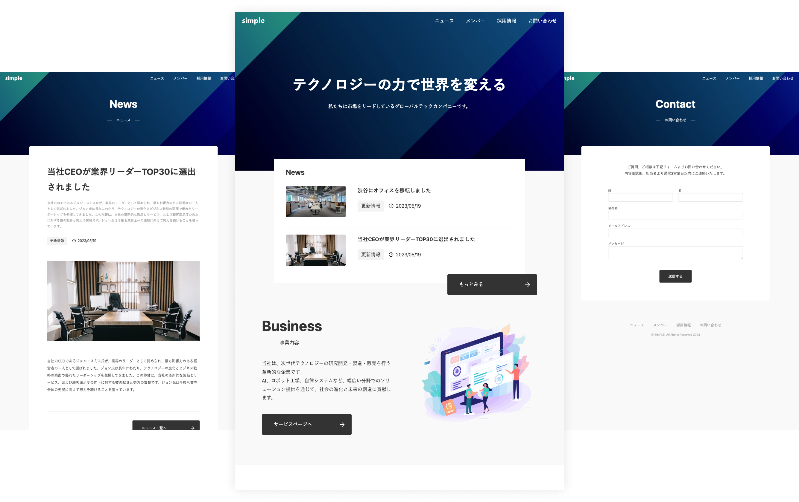

# シンプルなコーポレートサイト



microCMS 公式のシンプルなコーポレートサイトのテンプレートです。
サイト内のお問い合わせ送信先として CRM である [HubSpot](https://www.hubspot.jp/) を利用しています。

## 動作環境

Node.js 24 以上

## 環境変数の設定

ルート直下に`.env`ファイルを作成し、下記の情報を入力してください。

```
MICROCMS_API_KEY=xxxxxxxxxx
MICROCMS_SERVICE_DOMAIN=xxxxxxxxxx
BASE_URL=xxxxxxxxxx
HUBSPOT_PORTAL_ID=xxxxxxxx
HUBSPOT_FORM_ID=xxxxxxxx-xxxx-xxxx-xxxx-xxxxxxxxxxxx
```

`MICROCMS_API_KEY`  
microCMS 管理画面の「サービス設定 > API キー」から確認することができます。

`MICROCMS_SERVICE_DOMAIN`  
microCMS 管理画面の URL（https://xxxxxxxx.microcms.io）の xxxxxxxx の部分です。

`BASE_URL`
デプロイ先の URL です。プロトコルから記載してください。

例）  
開発環境 → http://localhost:3000  
本番環境 → https://xxxxxxxx.vercel.app/ など

`HUBSPOT_PORTAL_ID`
HubSpot のアカウント ID

`HUBSPOT_FORM_ID`
HubSpot のフォームに割り当てられる ID

## 開発の仕方

1. パッケージのインストール

```bash
npm install
```

2. 開発環境の起動

```bash
npm run dev
```

3. 開発環境へのアクセス  
   [http://localhost:3000](http://localhost:3000)にアクセス

## 解説ドキュメント

- [コンテンツ管理](https://github.com/microcmsio/nextjs-simple-corporate-site-template/blob/main/docs/content-management.md)
- [画面プレビューの設定](https://github.com/microcmsio/nextjs-simple-corporate-site-template/blob/main/docs/content-preview.md)
- [ディレクトリ構成](https://github.com/microcmsio/nextjs-simple-corporate-site-template/blob/main/docs/directory-structure.md)
- [HubSpot の準備](https://github.com/microcmsio/nextjs-simple-corporate-site-template/blob/main/docs/hubspot-setting.md)
- [Vercel へのデプロイ](https://github.com/microcmsio/nextjs-simple-corporate-site-template/blob/main/docs/vercel-deploy.md)

## 多言語ブログ化（フェーズ1：英語自動翻訳パイプライン）

ニュース記事（microCMSの`news` API）の日本語本文（`title` / `content`）から、英語版（`title_en` / `content_en`）を自動生成する仕組みです。

### 概要

1. microCMSで記事を保存すると、設定したWebhookから `/api/translate-article` が呼び出される
2. `translation_status` が「生成中」または「完了」の記事は何もせずスキップする（無限ループ防止）
3. 該当記事の `title` / `content` を取得し、Anthropic Claude APIで英訳する
4. 翻訳結果を `title_en` / `content_en` に書き戻し、`translation_status` を「完了」にする
5. 翻訳や書き戻しに失敗した場合は `translation_status` を「未処理」に戻す

英語版の表示は記事詳細ページに `?lang=en` を付与することで切り替えられます（例：`/news/xxxxx?lang=en`）。ページ上部の「日本語 / English」リンクからも切り替え可能です。`content_en` / `title_en` が未生成の場合は自動的に日本語表示にフォールバックします。

### microCMS側の設定

- `news` APIに以下の3フィールドを追加していること（本プロジェクトのスコープの前提）
  - `title_en`（テキストフィールド）
  - `content_en`（リッチエディタ）
  - `translation_status`（セレクトフィールド：未処理 / 生成中 / 完了、初期値：未処理）
- **書き込み専用のAPIキー**を新規発行し、`news` APIに対して **PATCH権限のみ** を付与する（閲覧用の`MICROCMS_API_KEY`とは別のキーにすること）。このキーを`MICROCMS_MANAGEMENT_API_KEY`として設定する
  - ※ microCMSには「マネジメントAPI」という別サービスも存在しますが、現状ベータ版でステータス変更等の限定操作のみに対応しており、任意フィールドの更新はできません。そのため本実装では通常のコンテンツAPI（PATCH）を書き込み専用キーで利用しています
- microCMS管理画面の「API設定 > Webhook」から、カスタム通知（一般Webhook）を追加する
  - リクエストURL：`https://<デプロイ先ドメイン>/api/translate-article`
  - メソッド：POST
  - カスタムヘッダー：`x-webhook-secret: <TRANSLATE_WEBHOOK_SECRETと同じ値>`
  - 通知タイミング：コンテンツの公開・更新時
  - リクエストボディ：microCMSの標準Webhookペイロード（トップレベルの`id`をcontentIdとして利用）をそのまま送信すればよい。カスタムテンプレートを使う場合は `{"contentId": "{{contentId}}"}` のようにcontentIdを含めること

### 環境変数

`.env.example`を参考に、下記を`.env.local`（またはこのテンプレートの慣例に合わせて`.env`）に設定してください。

```
MICROCMS_MANAGEMENT_API_KEY=xxxxxxxxxx
ANTHROPIC_API_KEY=sk-ant-xxxxxxxxxx
ANTHROPIC_MODEL=claude-sonnet-5
TRANSLATE_WEBHOOK_SECRET=xxxxxxxxxx
```

`MICROCMS_MANAGEMENT_API_KEY`と`ANTHROPIC_API_KEY`はサーバー側（Vercelの環境変数）でのみ使用し、クライアントに露出することはありません。Vercelにデプロイする場合は、プロジェクトの Environment Variables 設定にも同じ値を登録してください。

### スコープ外（今回未対応）

- 日本語・英語以外の言語（韓国語以降）への対応
- 地球儀UIなど本格的な言語切替UIの実装（簡易的な `?lang=en` 切替のみ）
- Supabase連携
- Vercel Deploy Hook / ISR revalidateの自動化。翻訳完了後にサイトへ反映するには、手動での再デプロイまたはキャッシュの再検証確認が必要です

## Node.js のバージョンについて

このテンプレートは **Node.js 24 以上**を前提としています。

Node.js では定期的にセキュリティアップデートが提供されています。  
安全にご利用いただくため、Node.js を利用する際は
**利用中のメジャーバージョン（例: 24.x）の最新パッチバージョンを使用することを推奨します。**

最新のセキュリティ情報については、以下をご参照ください。
https://nodejs.org/ja/blog/vulnerability/

## このテンプレートに含まれる `.npmrc` について

このテンプレートには、npm の `min-release-age` と `registry` 設定を有効にするための `.npmrc` ファイルが含まれています。

```ini
min-release-age=7
registry=https://npm.flatt.tech
```

`min-release-age` はサプライチェーン攻撃対策の一環として設定しているもので、公開から7日未満の npm パッケージバージョンをインストール対象から除外します。これにより、悪意のあるパッケージや改ざんされたパッケージが公開直後に利用されるリスクを軽減できます。

`registry` はレジストリを [Takumi Guard](https://flatt.tech/takumi/features/guard)（GMO Flatt Security が提供する npm セキュリティプロキシ）に向けるもので、`npm install` 時にパッケージを既知の脅威データベースと照合し、悪意のあるパッケージのインストールをブロックします。トークンなしの匿名利用で有効になり、追加の設定は不要です。この設定はローカルだけでなく、GitHub Actions や Dependabot による依存更新にも適用されます。

プロジェクトの要件や運用方針に応じて、これらの値を変更したり、設定を削除したりすることも可能です。
