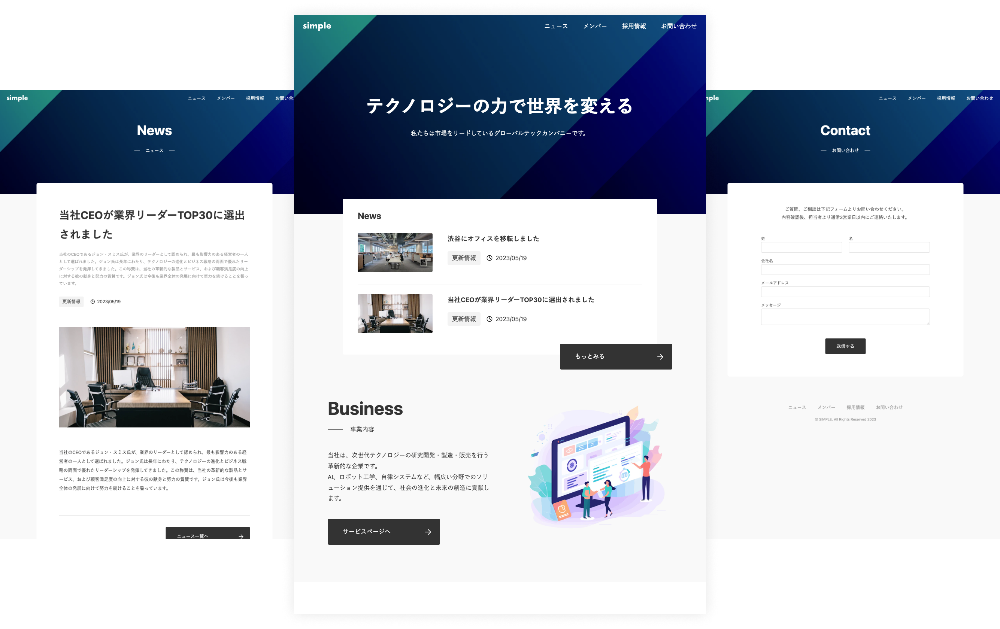

# シンプルなコーポレートサイト



microCMS 公式のシンプルなコーポレートサイトのテンプレートです。
サイト内のお問い合わせ送信先として CRM である [HubSpot](https://www.hubspot.jp/) を利用しています。

## 動作環境

Node.js 24 以上

## 環境変数の設定

ルート直下に`.env`ファイルを作成し、下記の情報を入力してください。

```
MICROCMS_API_KEY=xxxxxxxxxx
MICROCMS_SERVICE_DOMAIN=xxxxxxxxxx
BASE_URL=xxxxxxxxxx
HUBSPOT_PORTAL_ID=xxxxxxxx
HUBSPOT_FORM_ID=xxxxxxxx-xxxx-xxxx-xxxx-xxxxxxxxxxxx
```

`MICROCMS_API_KEY`  
microCMS 管理画面の「サービス設定 > API キー」から確認することができます。

`MICROCMS_SERVICE_DOMAIN`  
microCMS 管理画面の URL（https://xxxxxxxx.microcms.io）の xxxxxxxx の部分です。

`BASE_URL`
デプロイ先の URL です。プロトコルから記載してください。

例）  
開発環境 → http://localhost:3000  
本番環境 → https://xxxxxxxx.vercel.app/ など

`HUBSPOT_PORTAL_ID`
HubSpot のアカウント ID

`HUBSPOT_FORM_ID`
HubSpot のフォームに割り当てられる ID

## 開発の仕方

1. パッケージのインストール

```bash
npm install
```

2. 開発環境の起動

```bash
npm run dev
```

3. 開発環境へのアクセス  
   [http://localhost:3000](http://localhost:3000)にアクセス

## 解説ドキュメント

- [コンテンツ管理](https://github.com/microcmsio/nextjs-simple-corporate-site-template/blob/main/docs/content-management.md)
- [画面プレビューの設定](https://github.com/microcmsio/nextjs-simple-corporate-site-template/blob/main/docs/content-preview.md)
- [ディレクトリ構成](https://github.com/microcmsio/nextjs-simple-corporate-site-template/blob/main/docs/directory-structure.md)
- [HubSpot の準備](https://github.com/microcmsio/nextjs-simple-corporate-site-template/blob/main/docs/hubspot-setting.md)
- [Vercel へのデプロイ](https://github.com/microcmsio/nextjs-simple-corporate-site-template/blob/main/docs/vercel-deploy.md)

## 多言語ブログ化（12言語対応）

ニュース記事（microCMSの`news` API）の日本語本文（`title` / `content`）から、11言語ぶんの翻訳版（`title_<suffix>` / `content_<suffix>`）を自動生成する仕組みです。対応言語は日本語（原文）+ 韓国語 / 中国語 / ネパール語 / ロシア語 / ドイツ語 / イタリア語 / フランス語 / スペイン語 / ブラジルポルトガル語 / 英語 / フィリピノ語の12言語。対応言語の定義は `app/_libs/lang-registry.ts` に集約されており、言語を追加・削除する場合はこのファイルのコメントに従ってください。

地球儀UI（`app/_components/GlobeLanguageSwitcher/`）の12国旗リングから言語を切り替えられます（トップページ・記事ページの両方）。`title_<suffix>` / `content_<suffix>` が未生成の場合は自動的に日本語表示にフォールバックします。

### 概要

1. microCMSで記事を保存すると、設定したWebhookから `/api/translate-article` が呼び出される
2. `translation_status` が「生成中」の記事は、原則スキップする（多重実行防止）。ただし「生成中」になってから10分（`STALE_GENERATING_MS`、`app/_libs/translate-pipeline.ts`）以上経過している場合は、処理が途中で落ちて滞留したとみなし、ロックを無視して再試行する（詳細は後述）
3. 未翻訳の言語（`title_<suffix>` / `content_<suffix>` のいずれかが空の言語）だけを対象に、言語ごとに独立したAnthropic Claude API呼び出しで並行に翻訳する
4. 翻訳結果を書き戻し、書き込み後に読み直して検証する（保存されているはずのフィールドが実際に入っているかを確認してから「成功」とみなす）
5. 対象言語すべてが検証まで通った場合のみ `translation_status` を「完了」にする。1つでも失敗・未検証が残る場合は「生成中」のまま残す（「未処理」には戻さない。理由は次項）

### 「生成中」のまま滞留した記事の自動再試行について

翻訳や書き込みに失敗した言語が残る場合、`translation_status` は意図的に「未処理」へ戻さず「生成中」のまま残します。これは、新パイプライン未対応の旧コードが `translation_status` を見て多重実行防止を行っている環境（新旧コードが混在する移行期間）で、旧コードが「未処理」の記事を独自に（再）翻訳して上書きしてしまうのを防ぐためです。

その代わり、`translation_started`（「生成中」になった時刻）を毎回のロック取得時に打ち直し、次にその記事が処理される機会（Webhook再送信・記事の再編集・後述のバックフィルスクリプト実行）が来たときに、10分以上「生成中」のまま滞留していれば自動的に再試行します。これにより、Webhookのタイムアウトやサーバーエラーで処理が途中で落ちても、手動で `translation_status` を直さなくても自動的に回復します。

- **microCMS側で新しく追加が必要なフィールド**：`news` APIに `translation_started`（日時フィールド、時刻を含む、必須ではない）を追加してください。フィールドIDは `translation_started` にしてください。新しいセレクトの選択肢の追加は不要です（`translation_status` の候補値は変わりません）。
- 本番にまだ旧コードが動いている時点でこの変更をデプロイしても、旧コードは未知のフィールドを単に無視するだけなので、既存の翻訳を上書きしたり無限ループを起こしたりすることはありません（新フィールドは追加のみで、既存フィールドの意味は変えていません）。

### 既存記事への一括追加翻訳（バックフィルスクリプト）

対応言語をレジストリに追加した直後など、既存記事すべてに未翻訳の言語をまとめて追加したいときに使う、ローカル実行専用のスクリプトです。

```bash
# 確認モード（書き込みなし）。対象記事と未翻訳言語の一覧を表示する
npm run translate:backfill

# 実行モード。記事を1本ずつ順番に翻訳・書き込み・検証する
npm run translate:backfill -- --write
```

- 既存の翻訳は上書きしません（未翻訳の言語だけを対象にします）
- 記事ごとに、書き込み後に読み直して検証します（Webhookの `/api/translate-article` と同じ実装を共有、`app/_libs/translate-pipeline.ts`）
- 途中で失敗しても、再実行すれば残りの記事・言語だけが処理されます（完了済みの記事・言語はスキップされます）
- 現在「生成中」でロック中（かつ上記の滞留判定に該当しない）の記事はスキップし、Webhookと同時に走っても翻訳が二重に走りにくいようにしています
- 記事と記事の間に間隔（既定5秒、`TRANSLATE_BACKFILL_INTERVAL_MS` 環境変数で変更可）を空け、Anthropic APIのレート制限に配慮します
- 実行には `.env.local`（または `.env`）に `MICROCMS_SERVICE_DOMAIN` / `MICROCMS_API_KEY` / `MICROCMS_MANAGEMENT_API_KEY` / `ANTHROPIC_API_KEY` が必要です

### microCMS側の設定

- `news` APIに以下のフィールドを追加していること（本プロジェクトのスコープの前提）
  - 対応言語ごとの `title_<suffix>`（テキストフィールド）/ `content_<suffix>`（リッチエディタ）。`<suffix>` は `app/_libs/lang-registry.ts` の `translationField`（`ko` / `zh` / `ne` / `ru` / `de` / `it` / `fr` / `es` / `pt` / `en` / `fil`）
  - `translation_status`（セレクトフィールド：未処理 / 生成中 / 完了、初期値：未処理）
  - `translation_started`（日時フィールド、時刻を含む。上記「「生成中」のまま滞留した記事の自動再試行について」を参照）
- **書き込み専用のAPIキー**を新規発行し、`news` APIに対して **PATCH権限のみ** を付与する（閲覧用の`MICROCMS_API_KEY`とは別のキーにすること）。このキーを`MICROCMS_MANAGEMENT_API_KEY`として設定する
  - ※ microCMSには「マネジメントAPI」という別サービスも存在しますが、現状ベータ版でステータス変更等の限定操作のみに対応しており、任意フィールドの更新はできません。そのため本実装では通常のコンテンツAPI（PATCH）を書き込み専用キーで利用しています
- microCMS管理画面の「API設定 > Webhook」から、カスタム通知（一般Webhook）を追加する
  - リクエストURL：`https://<デプロイ先ドメイン>/api/translate-article`
  - メソッド：POST
  - カスタムヘッダー：`x-webhook-secret: <TRANSLATE_WEBHOOK_SECRETと同じ値>`
  - 通知タイミング：コンテンツの公開・更新時
  - リクエストボディ：microCMSの標準Webhookペイロード（トップレベルの`id`をcontentIdとして利用）をそのまま送信すればよい。カスタムテンプレートを使う場合は `{"contentId": "{{contentId}}"}` のようにcontentIdを含めること

### 環境変数

`.env.example`を参考に、下記を`.env.local`（またはこのテンプレートの慣例に合わせて`.env`）に設定してください。

```
MICROCMS_MANAGEMENT_API_KEY=xxxxxxxxxx
ANTHROPIC_API_KEY=sk-ant-xxxxxxxxxx
ANTHROPIC_MODEL=claude-sonnet-5
TRANSLATE_WEBHOOK_SECRET=xxxxxxxxxx
```

`MICROCMS_MANAGEMENT_API_KEY`と`ANTHROPIC_API_KEY`はサーバー側（Vercelの環境変数）でのみ使用し、クライアントに露出することはありません。Vercelにデプロイする場合は、プロジェクトの Environment Variables 設定にも同じ値を登録してください（Production / Preview の両方）。

## ページ読み上げ（Google Cloud Text-to-Speech）

記事ページ・トップページには、表示中の言語でテキストを読み上げる機能があります（`app/_libs/useReadAloud.ts` → `/api/tts` → Google Cloud Text-to-Speech）。

- 対応言語のうち、ネパール語（`ne`）以外は通常の Google Cloud TTS（Standard / Neural2 / WaveNet / Chirp3-HD）のボイスを使います
- **ネパール語（`ne-NP`）だけ Gemini TTS（プレビュー版）を使います**（`app/_libs/google-tts.ts`）。理由は、`ne-NP` には通常の Google Cloud TTS のボイスが1件も存在しないためです
  - Gemini TTS（プレビュー版）を使うには、サービスアカウントに通常の Cloud Text-to-Speech API の権限に加えて、**「Agent Platform ユーザー」（旧称「Vertex AI ユーザー」、ロールID: `roles/aiplatform.user`）** のロールを付与する必要があります。GCPコンソールの「IAMと管理」からサービスアカウントにこのロールを追加してください
  - それ以外の言語は既存のサービスアカウント権限（Cloud Text-to-Speech API の有効化 + `roles/cloudtts.user` 相当）のままで動作します。ネパール語対応のために新しく発行し直す環境変数はありません
- 音声の生成に失敗した場合（`/api/tts` が非200を返した場合など）は、読み上げUIが止まったまま無反応にならないよう、表示中の言語で短いエラーメッセージを表示し、再生ボタン・リップシンクを元の状態に戻します（`useReadAloud.ts` の `hasError`、`app/_libs/ui-strings.ts` の `readAloudError`）。途中のチャンクで失敗した場合も同じ扱いです
- 環境変数 `GOOGLE_APPLICATION_CREDENTIALS_JSON` の設定方法は `.env.example` のコメントを参照してください

## スコープ外（今回未対応）

- Supabase連携
- Vercel Deploy Hook / ISR revalidateの自動化。翻訳完了後にサイトへ反映するには、手動での再デプロイまたはキャッシュの再検証確認が必要です

## Node.js のバージョンについて

このテンプレートは **Node.js 24 以上**を前提としています。

Node.js では定期的にセキュリティアップデートが提供されています。  
安全にご利用いただくため、Node.js を利用する際は
**利用中のメジャーバージョン（例: 24.x）の最新パッチバージョンを使用することを推奨します。**

最新のセキュリティ情報については、以下をご参照ください。
https://nodejs.org/ja/blog/vulnerability/

## このテンプレートに含まれる `.npmrc` について

このテンプレートには、npm の `min-release-age` と `registry` 設定を有効にするための `.npmrc` ファイルが含まれています。

```ini
min-release-age=7
registry=https://npm.flatt.tech
```

`min-release-age` はサプライチェーン攻撃対策の一環として設定しているもので、公開から7日未満の npm パッケージバージョンをインストール対象から除外します。これにより、悪意のあるパッケージや改ざんされたパッケージが公開直後に利用されるリスクを軽減できます。

`registry` はレジストリを [Takumi Guard](https://flatt.tech/takumi/features/guard)（GMO Flatt Security が提供する npm セキュリティプロキシ）に向けるもので、`npm install` 時にパッケージを既知の脅威データベースと照合し、悪意のあるパッケージのインストールをブロックします。トークンなしの匿名利用で有効になり、追加の設定は不要です。この設定はローカルだけでなく、GitHub Actions や Dependabot による依存更新にも適用されます。

プロジェクトの要件や運用方針に応じて、これらの値を変更したり、設定を削除したりすることも可能です。
